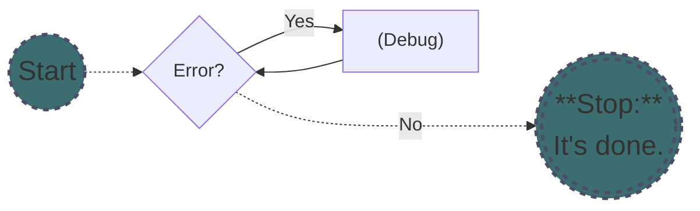
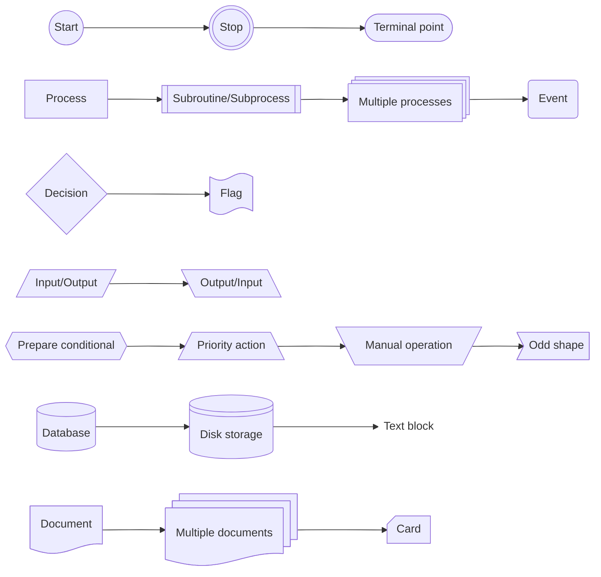

---
# the metadata of Markdown Preview Enhanced
html:
  embed_local_images: false
  embed_svg: false
  offline: true
  toc: true

print_background: true

export_on_save:
  html: true

# the metadata of Material for MkDocs
tags:
  - Markdown
  - MkDocs
---

# Material for MkDocs

## Formatting

- **Bold**
- *Italic*
- ~~Strikethrough~~
- ^^Underline^^
- Text with suggested changes: ==high light==
- Text with suggested changes: {++added++}
- Text with suggested changes: {--deleted--}
- Text with suggested changes: combined into {~~one~>a single~~} operation
- Text with suggested changes: {>>comments<<}
- 上標: 30^th^
- 下標: H~2~O
- Keyboard keys: ++ctrl+alt+del++
- --> <-- <--> =/= 1st 2nd 1/4

---

## Math block syntax

Blocks must be enclosed in `$$...$$` or `\[...\]` on separate lines.

$$
\cos x=\sum_{k=0}^{\infty}\frac{(-1)^k}{(2k)!}x^{2k}
$$

---

## Math inline block syntax

數學式 $1+2*3$

---

## List

1. ordered list 1
2. ordered list 2
    - unordered list 2a
    - unordered list 2b

---

## Description list

`key`

:   description 1.

    description 2.

---

## Task list

- [x] task list 1
    - [ ] task list 1a
- [ ] task list 2
- [x] task list 3

---

## Table

|  Method  | Description                          |
| :------: | ------------------------------------ |
|  `PUT`   | :material-check-all: Update resource |
|  `GET`   | :material-check:     Fetch resource  |
| `DELETE` | :material-close:     Delete resource |

/// caption | <
Table Caption prepend: to place a caption directly before a block
///

/// table-caption
Table Caption: to place a caption directly after a block
///

---

## Table with external content

{{ read_excel('./mkdocs-material/table.xlsx', engine='openpyxl', colalign=("center","right")) }}

/// table-caption
Table Caption: to place a caption directly after a block
///

---

## Link & Tooltip {#anchor-changed}

- [Link tooltip :fontawesome-solid-paper-plane:](./mkdocs-material.md/#anchor-changed "link tooltip"){ .md-button .md-button--primary }
- annother usage of [link]
- Icon tooltip: :material-information-outline:{ title="icon tooltip" }
- Abbreviation tooltip: The HTML specification is maintained by the W3C.
*[HTML]: Hyper Text Markup Language
*[W3C]: World Wide Web Consortium

[link]: ./mkdocs-material.md/#anchor-changed "link tooltip"

---

## Annotation

Lorem ipsum dolor sit amet, (1) consectetur adipiscing elit.
{ .annotate }

1. :man_raising_hand: I'm an **annotation**!

---

## Footnote

注腳 [^1]
[^1]:
    This is a footnote.
    Lorem ipsum dolor sit amet, consectetur adipiscing elit.

---

## Inline code

使用 `行內代碼` 展示。

---

## Introduction

> We're living the future so
> the present is our past.

---

## Admonition

???+ note inline end "Admonition Title"

    Lorem ipsum dolor sit amet, consectetur adipiscing elit.

!!! tip annotate "Admonition Title (1)"

    Lorem ipsum dolor sit amet, (2) consectetur adipiscing elit.

1. :man_raising_hand: I'm an annotation!
2. :woman_raising_hand: I'm an annotation as well!

---

## Code block

<div class="grid" markdown>

``` javascript title="add.js" linenums="10" hl_lines="1 3"
function add(x, y) {
  return x + y; // (1)
}
```

1. :man_raising_hand: code annotation!

``` yaml
theme:
  features:
    - content.code.annotate # (1)
```

1. :man_raising_hand: code annotation!

</div>

---

## Code block with external content

``` sql
--8<-- "./mkdocs-material/select.sql"
```

---

--8<-- "./mkdocs-material/sub-content.md"

---

## Tabbed

=== "C"

    ``` c
    #include <stdio.h>

    int main(void) {
      printf("Hello world!\n");
      return 0;
    }
    ```

=== "C++"

    ``` c++
    #include <iostream>

    int main(void) {
      std::cout << "Hello world!" << std::endl;
      return 0;
    }
    ```

=== "Tab 3"

    Lorem ipsum dolor sit amet, (1) consectetur adipiscing elit.
    { .annotate }

    1.  :man_raising_hand: I'm an annotation!

---

## Card grid: List syntax

<div class="grid cards" markdown>

- :fontawesome-brands-html5: **HTML**

    ---

    for content and structure

- :fontawesome-brands-js: **JavaScript**

    ---

    for interactivity

- :fontawesome-brands-css3: **CSS**

    ---

    for text running out of boxes

</div>

---

## Generic grid

<div class="grid" markdown>

descripton1

descripton2

descripton3

</div>

---

## Diagram

### Flowchart





---

## Image

{data-title="title" data-description="description" width="40%" align=right loading=lazy}
{data-description="description" width="30%" loading=lazy}

Lorem ipsum dolor sit amet, consectetur adipiscing elit.Nulla et euismod nulla. Curabitur feugiat, tortor non consequat finibus, justo purus auctor massa, nec semper lorem quam in massa.
